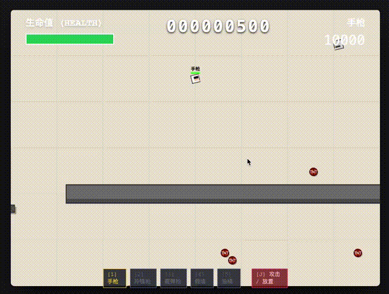
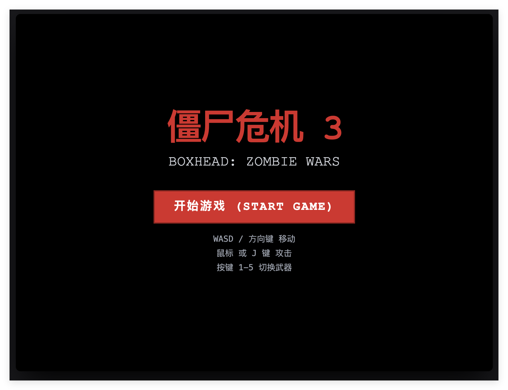
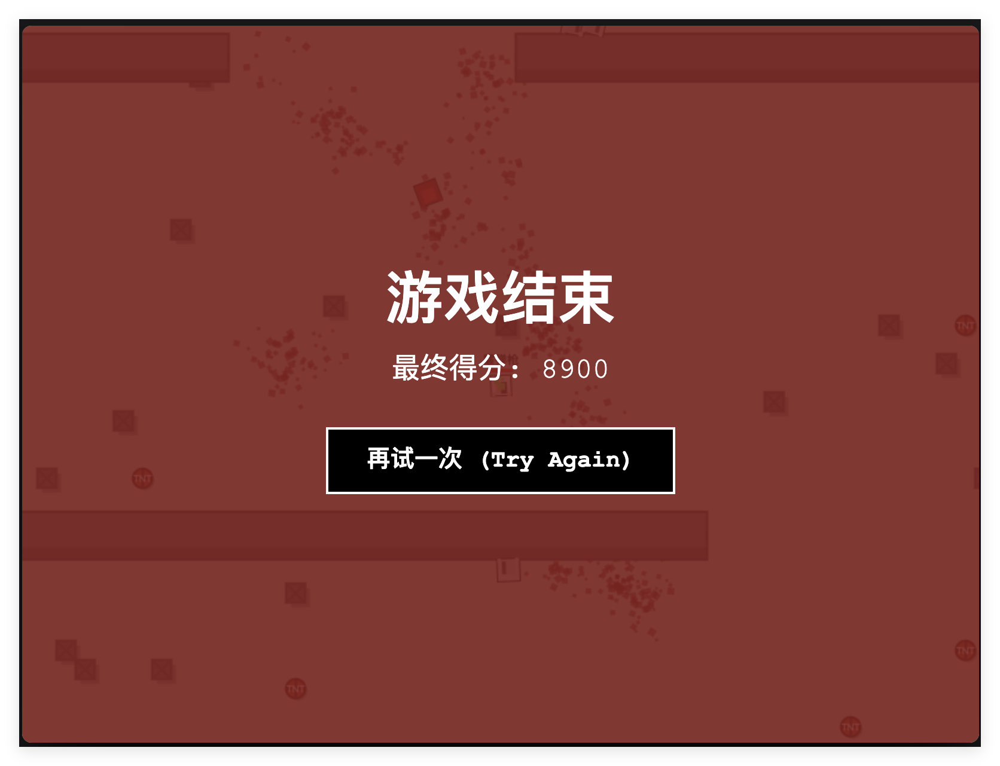
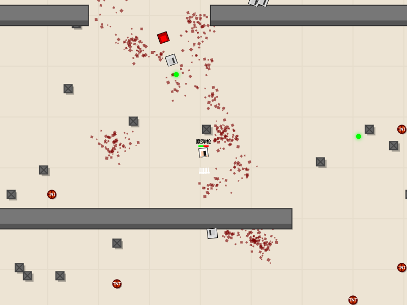

# 僵尸危机 3 (Boxhead Tribute) - React 重制版

这是一个基于 **React**, **TypeScript**, 和 **HTML5 Canvas** 的经典 Flash 游戏《僵尸危机 (Boxhead)》的高清复刻版。游戏使用了 **Matter.js** 物理引擎来实现真实的碰撞、击退和爆炸效果。

## 📂 项目文件结构

```text
src/
├── App.tsx                 # 应用主组件 (路由/菜单/游戏容器)
├── constants.ts            # 游戏常量 (速度, 伤害, 颜色, 地图大小)
├── types.ts                # TypeScript 类型定义 (实体, 武器枚举)
├── index.tsx               # 入口文件
├── components/
│   ├── GameCanvas.tsx      # 游戏主入口 (Refs初始化, 循环编排)
│   ├── UIOverlay.tsx       # 游戏 UI (血条, 分数, 弹药)
│   └── game/               # 游戏核心子系统
│       ├── types.ts        # 游戏上下文 (GameRefs) 定义
│       ├── mapSystem.ts    # 地图生成逻辑 (墙体坐标计算)
│       ├── physicsSystem.ts# 物理引擎配置 (碰撞监听, 爆炸效果)
│       ├── soundSystem.ts  # 音效合成系统 (Web Audio API)
│       ├── updateSystem.ts # 游戏逻辑更新 (移动, AI, 射击, 生成)
│       ├── renderSystem.ts # Canvas 渲染器 (绘图指令)
│       └── utils.ts        # 通用工具函数 (距离计算, 粒子生成)
```

## 🎮 游戏操作

| 按键 | 功能 |
| --- | --- |
| **W A S D** / 方向键 | 移动角色 |
| **鼠标** | 瞄准 (角色会自动朝向准星) |
| **鼠标左键** / **J** | 攻击 / 射击 / 放置物品 (按住可连发) |
| **1** | 切换 **手枪** (无限弹药, 强力击退) |
| **2** | 切换 **冲锋枪** (高射速) |
| **3** | 切换 **霰弹枪** (扇形攻击) |
| **4** | 放置 **假墙** (在脚下生成, 阻挡僵尸) |
| **5** | 放置 **油桶** (易爆物, 受到攻击爆炸) |

## 🖼️ 游戏截图








## ✨ 游戏特性

*   **物理引擎驱动**: 使用 `Matter.js` 实现真实的物体交互。
    *   **击退效果**: 子弹击中僵尸会产生基于物理的击退力，且在僵尸群中具有传导性。
    *   **爆炸冲击**: 油桶爆炸会将周围的实体炸飞。
    *   **碰撞判定**: 玩家具有超高“质量”，在尸潮中巍然不动，只会持续掉血，不会被推动。
*   **智能辅助**:
    *   **自动瞄准**: 当敌人进入射程时，持枪状态下会自动锁定最近的敌人。
    *   **无阻挡放置**: 玩家放置的假墙不会卡住自己（Collision Mask 过滤），但会阻挡僵尸。
*   **动态难度**:
    *   **波次系统**: 随着杀敌数增加，僵尸和恶魔的数量会不断增多。
    *   **分数增强**: 每获得 10,000 分，怪物生成速度和上限会额外提升 10%，并伴有红色警报提示。
*   **连击系统**: 快速击杀敌人可以积累倍率 (Multiplier)，获得更高分数。
*   **超大地图**: 1600x1200 的超大战场，配备摄像机跟随系统。
*   **防御工事**: 地图自带三道带有交错缺口的防线，玩家可自由建造墙体和炸药桶。

## 🛠️ 技术架构

项目采用模块化设计，将游戏逻辑拆分为多个子系统，位于 `src/components/game/` 目录下：

### 核心模块

1.  **`GameCanvas.tsx` (编排器)**
    *   管理 React 生命周期。
    *   初始化 `GameRefs`（包含所有游戏状态的可变引用）。
    *   启动 `requestAnimationFrame` 游戏主循环。

2.  **`physicsSystem.ts` (物理系统)**
    *   集成 `Matter.js`。
    *   **高密度玩家**: 设置玩家密度为 100，确保不被僵尸推动。
    *   **持续伤害**: 在 `collisionActive` 中处理僵尸对玩家的持续接触伤害。
    *   处理爆炸逻辑 (`createExplosion`)：施加径向力。

3.  **`updateSystem.ts` (逻辑更新)**
    *   每一帧的逻辑运算。
    *   **AI 行为**: 寻路、朝向玩家、受击硬直 (Stun) 逻辑。
    *   **难度控制**: 监控分数变化，动态调整 `spawnRate` 和 `maxEnemies`。
    *   **生成系统**: 动态生成僵尸和掉落物。

4.  **`renderSystem.ts` (渲染系统)**
    *   纯 Canvas 2D 绘图。
    *   处理摄像机偏移 (Camera Transform)。
    *   绘制 UI 消息 (Game Message)、背景、血迹、墙体、实体、子弹轨迹、粒子效果。

5.  **`soundSystem.ts` (音效系统)**
    *   使用 Web Audio API 实时合成枪声、爆炸声和拾取音效，不依赖外部音频文件。

## 🚀 运行项目

本项目使用标准的 React 构建工具。

1.  **安装依赖**
    ```bash
    npm install
    ```

2.  **启动开发服务器**
    ```bash
    npm start
    ```

3.  **构建生产版本**
    ```bash
    npm run build
    ```

## 📝 开发备注

*   **性能优化**: 游戏状态存储在 `useRef` 中而不是 `useState`，以避免 React 在每帧 60 次的频率下重新渲染组件。只有 UI 层（血条、分数）会低频触发 React 更新。
*   **物理参数**: 调整 `constants.ts` 中的 `PLAYER_SPEED`, `ZOMBIE_SPEED` 可以改变游戏节奏。

---
*致敬经典 Flash 游戏 Boxhead 系列*
